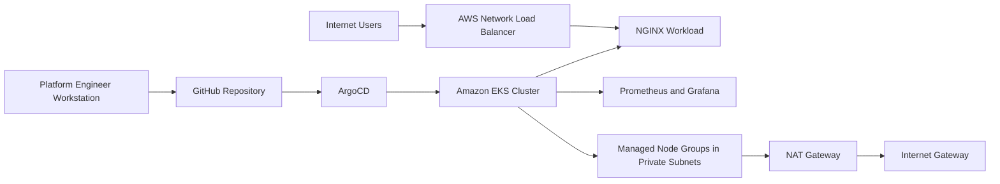

# Production-Ready GitOps Kubernetes Platform on AWS EKS using Terraform, ArgoCD, Prometheus & Grafana

## Executive Summary

This repository defines a production-ready GitOps Kubernetes platform on Amazon EKS. It uses Terraform for AWS infrastructure, ArgoCD for continuous reconciliation, NGINX as a representative application workload, and Prometheus plus Grafana for observability.

The architecture is designed for professional cloud environments where engineers may work from shared public IP networks or CGNAT connections. Administrative access uses AWS-managed endpoints and `kubectl port-forward` where appropriate, with no dependency on inbound connectivity to a local workstation.

## Architecture Overview



Detailed architecture notes are available in [docs/architecture/architecture.md](docs/architecture/architecture.md).

## Technology Stack

- AWS VPC, public subnets, private subnets, Internet Gateway, NAT Gateway, route tables, security groups
- Amazon EKS with managed node groups
- AWS KMS encryption for Kubernetes secrets
- IAM roles and IAM OIDC provider for future IRSA integrations
- Terraform modular infrastructure code
- ArgoCD GitOps reconciliation
- NGINX workload exposed through an AWS Network Load Balancer
- Prometheus, Grafana, and Metrics Server
- GitHub Actions quality gates for Terraform and Kubernetes manifests

## Project Structure

```text
terraform/
  modules/
    vpc/
    eks/
    security-groups/
  environments/
    prod/
kubernetes/
  argocd/
  prometheus/
  grafana/
  nginx/
scripts/
docs/
  architecture/
  screenshots/
.github/
  workflows/
```

## Deployment Steps

Review [docs/deployment.md](docs/deployment.md) before executing any command. The intended order is:

1. Configure the Terraform remote state backend from `terraform/environments/prod/backend.tf.example`.
2. Review and adjust `terraform/environments/prod/terraform.tfvars.example`.
3. Provision AWS infrastructure from `terraform/environments/prod`.
4. Configure Kubernetes access for the created EKS cluster.
5. Create Grafana administrator credentials through an approved secret process.
6. Apply the ArgoCD installation manifests.
7. Apply the ArgoCD bootstrap manifests after ArgoCD CRDs are available.
8. Allow ArgoCD to reconcile NGINX, Prometheus, Grafana, and Metrics Server.

## Validation Steps

- Confirm the EKS cluster endpoint and managed node groups are active.
- Confirm Kubernetes nodes are ready across two availability zones.
- Confirm ArgoCD server, repo server, application controller, and Redis pods are ready.
- Confirm the `enterprise-platform-root` application is synced and healthy.
- Confirm the NGINX service receives an AWS load balancer hostname.
- Confirm Metrics Server returns node and pod metrics.
- Confirm Prometheus targets are up.
- Confirm Grafana can reach the Prometheus datasource.

## Observability Overview

Prometheus runs in the `monitoring` namespace with persistent storage on encrypted gp3 EBS volumes. It scrapes the Kubernetes API, nodes, cAdvisor metrics, annotated pods, and itself. Grafana is kept private through a ClusterIP service and is intended to be accessed with `kubectl port-forward` for administration.

Metrics Server is deployed into `kube-system` so HorizontalPodAutoscaler resources can consume CPU and memory metrics.

## Security Considerations

- Worker nodes run in private subnets.
- The Kubernetes API supports public and private access for engineers behind shared IP networks.
- Public API access should be combined with strong IAM controls, MFA, CloudTrail, and least-privilege RBAC.
- Kubernetes secrets are encrypted with a dedicated AWS KMS key.
- Grafana credentials are not included in the reconciled manifests.
- ArgoCD is not exposed through a public load balancer by default.
- NGINX is the only public workload and is exposed through an AWS managed load balancer.
- Workloads define resource requests, limits, probes, security contexts, and namespace separation.

## Cleanup Procedures

Cleanup should be performed in reverse order:

1. Remove ArgoCD-managed applications.
2. Remove Kubernetes workloads and persistent claims after retaining required data.
3. Remove AWS load balancers created by Kubernetes services.
4. Remove Terraform-managed AWS resources from `terraform/environments/prod`.
5. Confirm retained EBS volumes, CloudWatch log groups, and remote state resources meet the retention policy.

## Future Enhancements

- AWS Load Balancer Controller with IRSA and Ingress resources
- External Secrets Operator integrated with AWS Secrets Manager
- Private container images in Amazon ECR
- Open Policy Agent Gatekeeper or Kyverno policy enforcement
- Centralized logging with Amazon OpenSearch Service or Grafana Loki
- Managed certificate automation through AWS Certificate Manager
- AWS WAF for public HTTP workloads
- SSO integration for ArgoCD and Grafana
- Dedicated workload node groups with taints and placement rules

## Commit Recommendations

- `Initialize AWS EKS GitOps platform foundation`
- `Add modular Terraform infrastructure for production EKS`
- `Add ArgoCD application reconciliation manifests`
- `Add Prometheus Grafana and Metrics Server observability`
- `Add operational documentation and repository quality gates`
