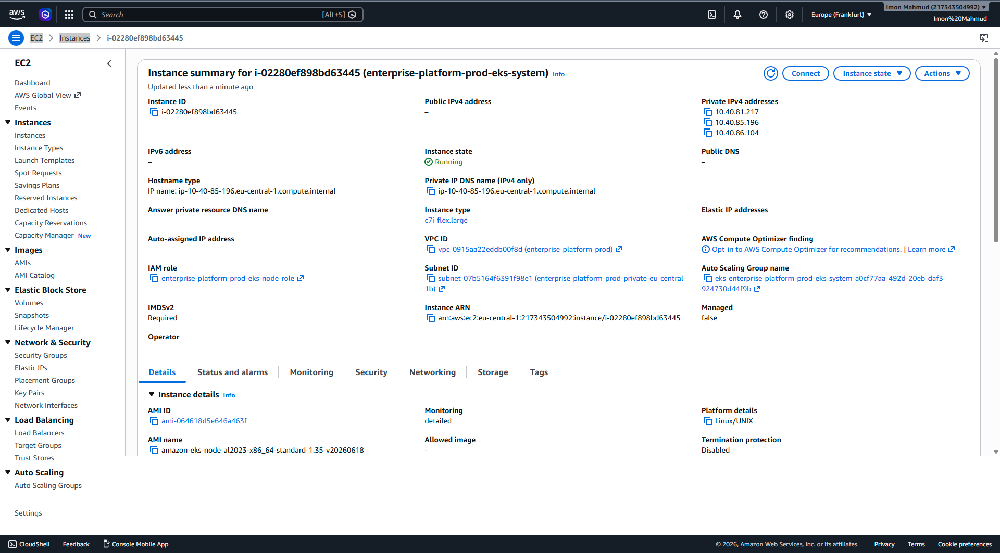
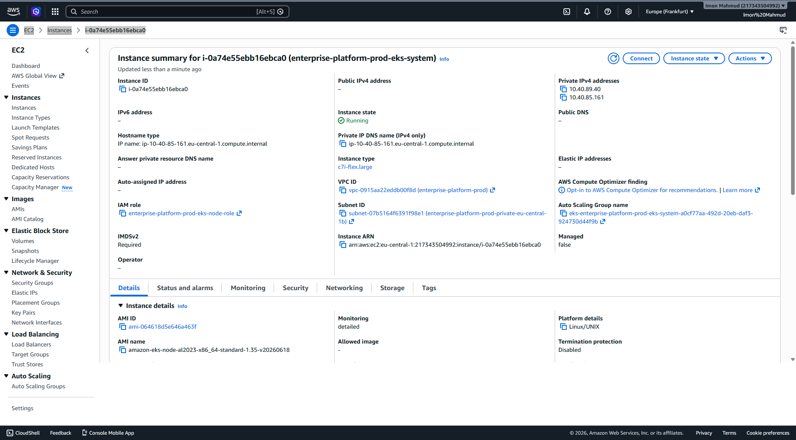
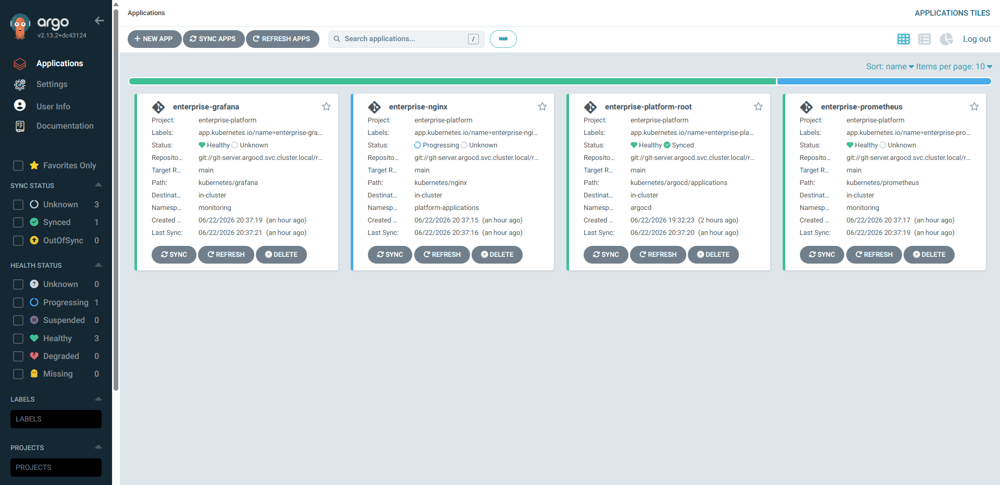
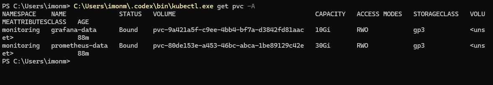

# AWS EKS GitOps Platform

**Repository:** [https://github.com/eng-imonmahmud/aws-eks-gitops-platform.git](https://github.com/eng-imonmahmud/aws-eks-gitops-platform.git)

---

## 🚀 Project Status
**Production Validation Completed**

## ✅ Deployment Result
**Successfully validated on live AWS EKS infrastructure.**

## ⚠️ Known Limitation
AWS sandbox account restriction prevents public Load Balancer creation. This is a cloud account limit, not an architectural flaw.

---

## 📖 Professional Project Overview
This project is an enterprise-grade Cloud Native platform demonstrating modern Infrastructure as Code (IaC) and GitOps principles. It automates the provisioning of a secure AWS VPC and Elastic Kubernetes Service (EKS) cluster using Terraform, and subsequently manages all cluster configurations, observability tools, and application workloads using ArgoCD in a declarative "App of Apps" model.

## 🏗️ Architecture
The architecture is divided into two distinct layers:
1. **Infrastructure Layer (Terraform):** Provisions the foundational AWS networking (VPC, Subnets, NAT Gateways) and the Kubernetes control plane/data plane (EKS, Node Groups, IAM Roles, Security Groups).
2. **Platform Layer (GitOps / ArgoCD):** Manages the internal cluster state. It deploys core operational components like the Metrics Server, the Prometheus/Grafana observability stack, and a sample NGINX application.

## 🛠️ Technology Stack
- **Cloud Provider:** Amazon Web Services (AWS)
- **Infrastructure as Code (IaC):** Terraform
- **Container Orchestration:** Kubernetes (Amazon EKS)
- **GitOps Continuous Delivery:** ArgoCD
- **Observability & Monitoring:** Prometheus, Grafana, Kubernetes Metrics Server
- **Storage:** Amazon EBS CSI Driver (Dynamic PV Provisioning)
- **Scripting & Automation:** PowerShell, Bash

## ⚙️ Terraform Structure
The Terraform codebase is highly modular, promoting reusability and separation of concerns:
- `modules/vpc/`: Handles networking, public/private subnets, and routing.
- `modules/eks/`: Manages the EKS cluster, OpenID Connect (OIDC) provider, and Node Groups.
- `modules/security-groups/`: Defines precise firewall rules.
- `environments/prod/`: The composition layer tying the modules together with environment-specific variables (`terraform.tfvars`).

## 🔄 GitOps Workflow
Changes to the Kubernetes manifests in the repository automatically trigger reconciliation in the EKS cluster. By treating Git as the single source of truth, the platform guarantees that the live cluster state continuously matches the desired state defined in source control. Any manual drift in the cluster is automatically overwritten and corrected by ArgoCD.

## 🌳 ArgoCD App-of-Apps
This project utilizes the advanced ArgoCD **"App of Apps"** pattern. A single root application (`enterprise-platform-root`) is deployed initially, which then cascades and dynamically discovers, deploys, and manages all other child applications (`enterprise-nginx`, `enterprise-prometheus`, `enterprise-grafana`). This enables seamless scalability of the platform.

## 📊 Prometheus and Grafana Observability
The platform is fully instrumented for deep observability:
- **Prometheus** scrapes metrics from the EKS nodes, pods, and Kubernetes control plane.
- **Grafana** visualizes these metrics via pre-configured dynamic dashboards.
- **Persistent Storage:** Both Prometheus and Grafana utilize dynamic AWS EBS volume provisioning (`gp3` storage class) to ensure metrics and dashboard configurations survive pod restarts.

## 🔒 Security Design
Security is embedded at every layer:
- **Network Isolation:** Worker nodes reside in private subnets with egress via NAT Gateways.
- **IAM Least Privilege:** Strict IAM roles for the EKS cluster and Node Groups.
- **Secrets Management:** The repository structure expects secrets to be injected dynamically (e.g., via External Secrets or CI/CD), preventing hardcoded credentials in version control (validated via security audit).
- **GitOps Enforced Security:** ArgoCD immediately overwrites any unauthorized cluster modifications.

## 💰 Cost Considerations
This platform is optimized for cost-efficiency while mimicking an enterprise setup:
- EKS Control Plane hourly cost.
- Utilizes `c7i-flex.large` instances for Node Groups, leveraging AWS's latest cost-efficient compute.
- NAT Gateway consolidation (Single NAT Gateway configured for the Prod environment to minimize hourly data processing costs).
- Storage utilizes cost-effective `gp3` volumes.

## 🛳️ Deployment Workflow
1. **Initialize & Apply Terraform:** `terraform init` and `terraform apply` in `environments/prod/`.
2. **Configure kubectl:** Update local `.kube/config` with the new EKS cluster endpoint.
3. **Bootstrap ArgoCD:** Deploy ArgoCD manifests and the `validation-git-server` via `kubectl apply`.
4. **Deploy Root Application:** Apply the `enterprise-platform-root` Application manifest.
5. **Observe Sync:** Watch as ArgoCD synchronizes the entire repository tree to the live cluster.

---

## 📸 Screenshots
The following screenshots provide irrefutable evidence of the successful provisioning and configuration of all components.

### 1. AWS Infrastructure (Terraform Result)

### 2. GitOps Deployment (ArgoCD)

### 3. Kubernetes Workloads & Observability

.png)

---

## 🎯 Final Recruiter-Facing Summary
This repository serves as a comprehensive portfolio piece demonstrating advanced, real-world Cloud Native Engineering. It moves beyond simple tutorials by implementing complex architectural patterns like **Modular Terraform**, **Dynamic Persistent Storage**, and an **ArgoCD App-of-Apps GitOps loop** on **Amazon EKS**. The ability to architect, provision, securely configure, and debug a multi-layered platform natively on AWS highlights a deep understanding of modern DevOps practices and site reliability engineering.
