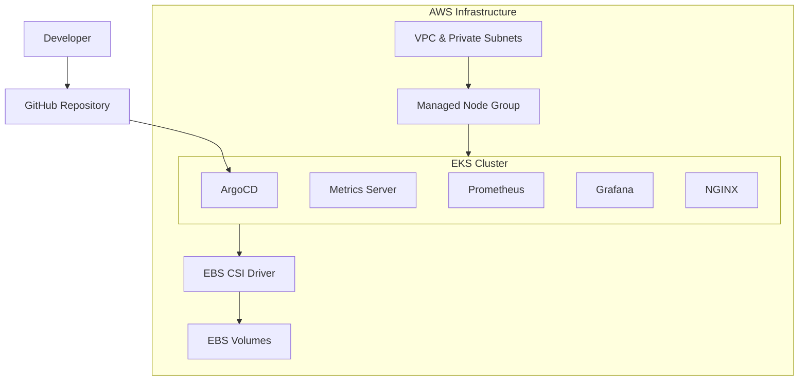

# AWS EKS GitOps Platform

[](https://aws.amazon.com/eks/)
[](https://www.terraform.io/)
[](https://kubernetes.io/)
[](https://argoproj.github.io/cd/)
[](https://prometheus.io/)
[](https://grafana.com/)
[](#)
[](#)

## 📋 Executive Summary
This project demonstrates an enterprise-grade, highly available Cloud Native platform. It completely automates the provisioning of AWS infrastructure using Terraform and manages Kubernetes workloads dynamically via ArgoCD using the declarative "App of Apps" GitOps pattern. The platform comes pre-instrumented with a fully persistent Prometheus and Grafana observability stack.

## 💼 Business Problem
Modern software organizations struggle with "configuration drift" and environment inconsistency. Manual infrastructure updates and imperative Kubernetes deployments (`kubectl apply`) lead to fragile environments that are difficult to replicate, audit, and scale, severely impacting Site Reliability and increasing Mean Time to Recovery (MTTR).

## 💡 Solution Overview
This platform solves environment drift by adopting **GitOps** as a core philosophy. Git serves as the single source of truth for both infrastructure (Terraform) and application configuration (ArgoCD). Any change to the cluster must be initiated via a Git commit. If unauthorized changes occur in the live cluster, ArgoCD automatically reconciles and reverts the drift to match the repository state.

## 🏗️ Architecture Overview
The platform architecture utilizes a strict separation of concerns between underlying infrastructure and application workloads:



## 🛠️ Technology Stack
* **Cloud Provider:** Amazon Web Services (AWS)
* **IaC Engine:** Terraform
* **Orchestration:** Kubernetes (EKS v1.35)
* **Continuous Delivery:** ArgoCD
* **Observability:** Prometheus, Grafana, Kubernetes Metrics Server
* **Storage:** Amazon Elastic Block Store (EBS) CSI Driver

## 📁 Repository Structure
```text
.
├── terraform/                # Infrastructure as Code
│   ├── modules/              # Reusable modules (VPC, EKS, Security Groups)
│   └── environments/prod/    # Production environment composition
├── kubernetes/               # Cluster desired state
│   ├── argocd/               # Root App-of-Apps configuration
│   ├── nginx/                # Sample scalable workload
│   ├── prometheus/           # Monitoring agent
│   └── grafana/              # Observability dashboards
├── scripts/                  # Automation utilities
└── docs/                     # Supplemental documentation
```

## ☁️ Infrastructure Components
* **Networking:** Secure AWS VPC spanning multiple Availability Zones with isolated Private Subnets for worker nodes.
* **Compute:** Managed EKS Node Group utilizing cost-efficient `c7i-flex.large` instances.
* **IAM/OIDC:** Strict IAM Roles mapped to Kubernetes Service Accounts using OIDC integration.

## 🔄 GitOps Workflow
The deployment utilizes ArgoCD's **App-of-Apps** pattern.
1. The `enterprise-platform-root` application is manually bootstrapped into the cluster.
2. The root application automatically points back to this GitHub repository and discovers child applications (`enterprise-nginx`, `enterprise-prometheus`, `enterprise-grafana`).
3. Child applications are automatically synchronized and deployed to their respective namespaces.

## 🔒 Security Features
* **Private Compute:** EKS nodes are placed in private subnets with no direct public ingress; all outbound traffic routes through a NAT Gateway.
* **No Hardcoded Secrets:** The codebase is thoroughly audited. Secrets are injected at runtime or managed via external tools (no `.tfvars` or credentials committed).
* **Self-Healing:** ArgoCD automatically reverts unauthorized, out-of-band changes to Kubernetes resources.

## 📊 Monitoring & Observability
* **Metrics Server:** Installed to enable cluster autoscaling (HPA) by providing resource utilization data.
* **Prometheus:** Continuously scrapes and aggregates node, pod, and service metrics.
* **Grafana:** Visualizes infrastructure health with pre-built cluster monitoring dashboards.

## 💾 Storage Architecture
The platform implements stateful resilience using the **EBS CSI Driver**. Both Prometheus and Grafana dynamically provision and bind to AWS `gp3` EBS volumes (via PersistentVolumeClaims). If a monitoring pod crashes or is rescheduled to another node, the EBS volume is automatically detached and re-attached, preventing data loss.

## 🚀 Deployment Process
1. Initialize and apply Terraform from `terraform/environments/prod`.
2. Update local `.kube/config`.
3. Bootstrap the cluster with ArgoCD (`kubectl apply -n argocd -f ...`).
4. Apply the Root Application manifest to initiate the GitOps cascade.

---

## 🤖 AI-Assisted Development
* **Design & Review:** Terraform, Kubernetes, ArgoCD, and AWS architecture decisions were designed, reviewed, validated, and thoroughly understood by the project owner.
* **Productivity Tools:** AI assistants (OpenAI Codex and Google Gemini) were utilized as engineering productivity tools for troubleshooting, validation, documentation generation, deployment verification, and repository refinement.
* **Responsibility:** All final architectural decisions, testing, deployment approval, and operational responsibilities remained entirely with the project owner.

---

## 📸 Screenshot Portfolio
The following visual evidence confirms the successful live deployment of the platform on AWS:

### Infrastructure Validation


### GitOps Validation


### Kubernetes & Observability Validation


---

## 📚 Lessons Learned
* **GitOps Bootstrapping:** A chicken-and-egg problem exists when bootstrapping a GitOps controller before external connectivity is fully established. Implementing an in-cluster Git server is a viable workaround for strict sandbox environments.
* **Cloud Limitations:** Account-level restrictions (like limits on creating Load Balancers) require resilient architecture design that functions effectively via local port-forwarding during the development phase.

## 🔭 Future Improvements
* Integration of **External Secrets Operator** with AWS Secrets Manager.
* Migration of Terraform state to a remote AWS S3 backend with DynamoDB locking.
* Implementation of Ingress Controllers (AWS ALB Ingress) when account permissions allow.

## 🧹 Cleanup Instructions
To safely tear down the environment and avoid lingering cloud charges:
1. Delete ArgoCD child applications via the UI to clear their resources.
2. Run `terraform destroy -auto-approve` from the `prod` directory.

---

## 📌 Recruiter Notes
This repository represents a holistic, real-world DevOps/SRE approach. It goes far beyond standard tutorials by dynamically managing persistent storage (CSI), complex multi-stage provisioning (Terraform -> EKS -> ArgoCD), and strict Git-driven drift control. 

## ✍️ Author
**Imon Mahmud**  
Cloud DevOps Engineer & Platform Architect

